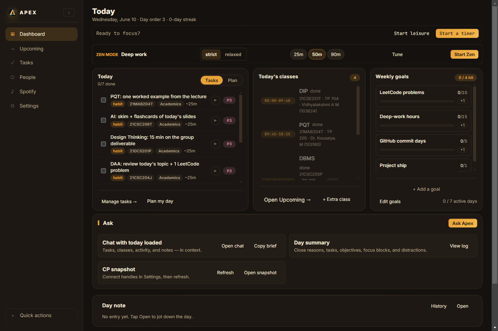
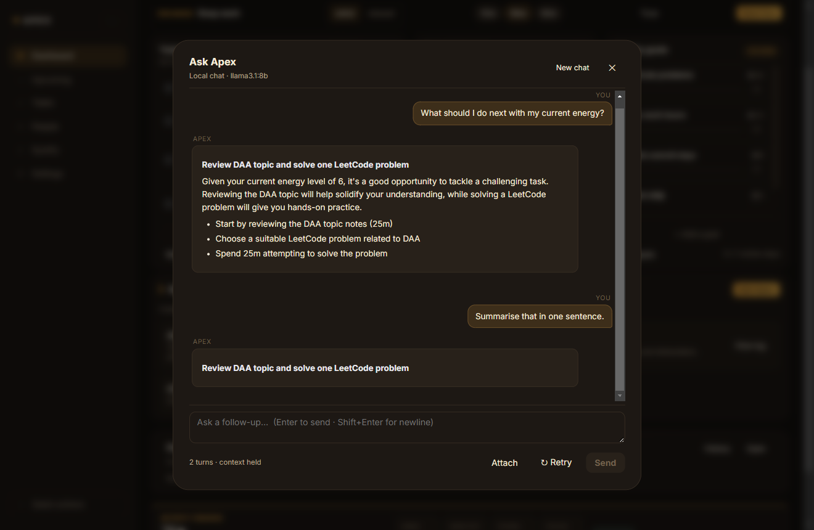
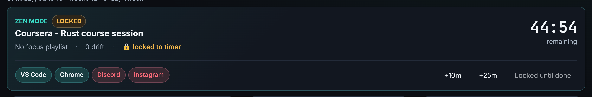
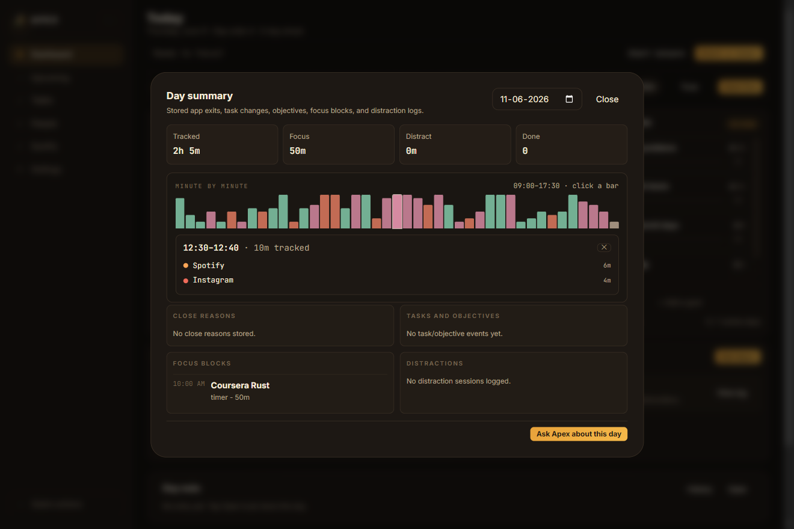
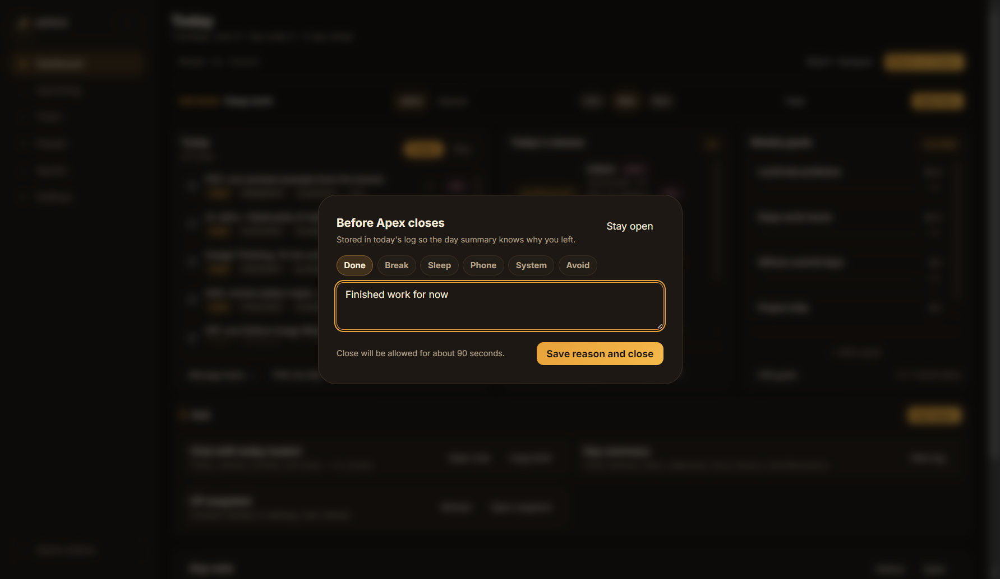
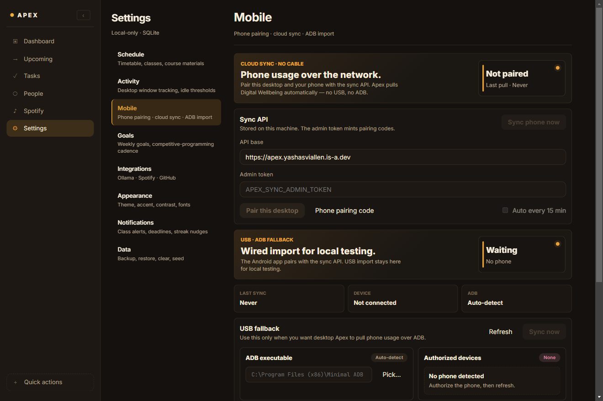
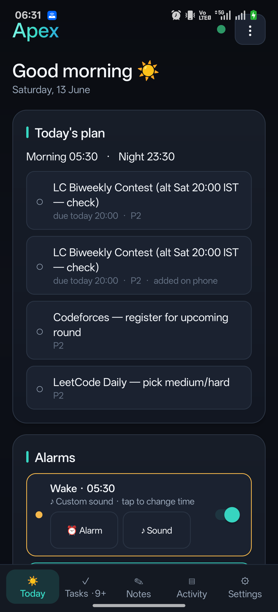
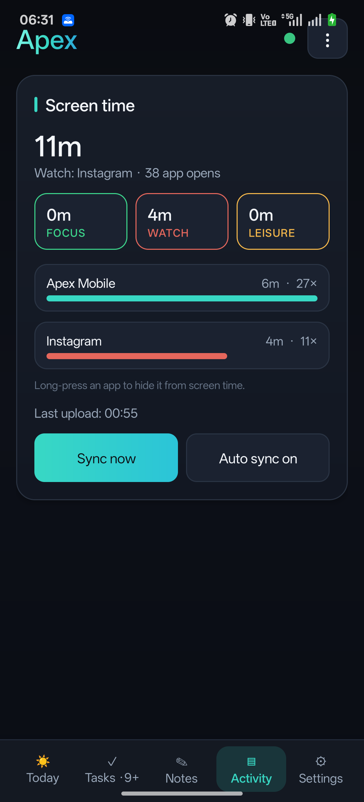

# Apex

**Your day, in one place — and honest about it.**

Apex is a personal productivity OS built for college life. It knows your timetable, keeps your tasks, watches where your hours actually go (desktop *and* phone), guards your focus, wakes you up, and ends the day with a private journal — all running locally on your machine, with an AI planner that never sends your life to someone else's cloud.

[**⬇ Download the latest release**](https://github.com/JavaProgswing/Personal-Apex/releases/latest) — Windows installer, portable exe, and the Android APK.

---

## Screenshots

| Dashboard | Ask Apex (multi-turn) | Zen mode (locked) |
|---|---|---|
|  |  |  |

| Day summary | Close guard | Settings → Mobile |
|---|---|---|
|  |  |  |

| Android — Today | Android — Activity |
|---|---|
|  |  |

---

## What it does

- **One dashboard for the whole day.** Today's classes (SRM day-order aware), tasks, weekly goals, a live "what am I doing right now" timer, and a 7-day picture of where your time went.
- **Knows where your hours go — everywhere.** The desktop tracks your foreground window (which app, which site, for how long, idle-aware). The Android app syncs your phone's screen time over the network — no cable. Both land in one timeline, accurate to what Digital Wellbeing reports.
- **Defends your focus.** Zen mode blocks distracting apps in strict, relaxed, or *locked* flavors — locked can't be stopped until the timer runs out, and your phone mirrors the block, bouncing Instagram back to the home screen mid-session. Closing the app during work hours asks you *why*, and the reason lands in your day log.
- **Wakes you up properly.** Real alarms from the phone — looping ringtone, vibration, full-screen Dismiss / Snooze / "I'm awake ✓". Marking yourself awake triggers a morning brief on the desktop: classes today, top task, go.
- **An AI that knows your context.** Ask Apex is a streaming chat with a local Ollama model that sees your schedule, open tasks, screen time, and (opt-in) syllabus + journal summaries. Plan the evening, triage the backlog, extract tasks from a PDF — all offline.
- **Plans around your college reality.** Syllabus-aware suggestions, CT-date prioritization (the units for the nearest test outrank everything else until it's done), contest reminders, and a classmate radar that tracks what people around you are building on GitHub and the judges.
- **Closes the day honestly.** A per-day debrief — focus sittings, distractions, wins, exit reasons — plus a passcode-protected private journal that never leaves your machine.
- **Phone as a first-class citizen.** Tasks, notes, alarms, and screen time flow both ways through a small self-hosted sync server. There's a browser version too (`/web`), with a Three.js + GSAP face.

## The pieces

| Piece | What | Where |
|---|---|---|
| **Desktop** | Electron + React + SQLite, everything local | this repo, [releases](https://github.com/JavaProgswing/Personal-Apex/releases/latest) |
| **Android** | Kotlin companion — alarms, screen time, tasks, notes, Zen mirror | [`mobile_android/`](mobile_android/README.md) |
| **Sync server** | Self-hosted FastAPI — pairing, sync, focus state, web app | [`sync_api/`](sync_api/README.md) |

## Privacy, in one paragraph

Your database is a single SQLite file in `Documents/Apex`. The AI runs on `localhost` through Ollama. The journal is passcode-gated with scrypt and never syncs. The only things that ever leave your machine are the syncs you explicitly set up — to **your own** server — and the GitHub/LeetCode/Codeforces lookups you trigger by hand.

## Docs

- [Usage & technical guide](docs/USAGE.md) — setup, architecture, database, integrations, shortcuts.
- [Android app](mobile_android/README.md) — features, build, pairing.
- [Sync API](sync_api/README.md) — endpoints, deploy, environment.
